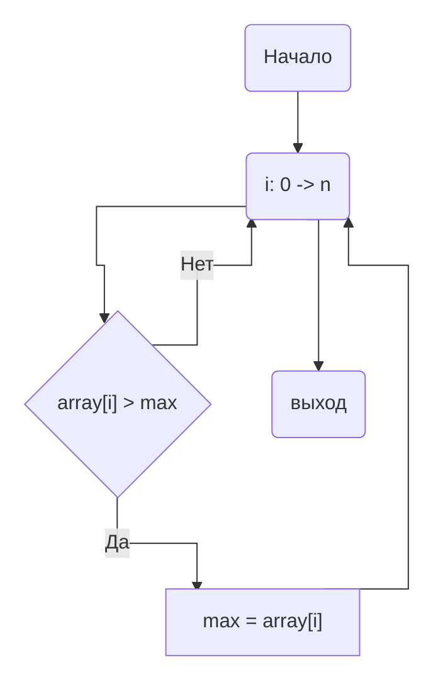

<h1>НИЯУ МИФИ. Лабораторная работа №1. Никифоров Степан, Б21-502. 2023</h1>

<h2>Используемая система</h2>

<pre>
                   -`                    defkit@archlinux
                  .o+`                   ----------------
                 `ooo/                   OS: Arch Linux x86_64
                `+oooo:                  Kernel: 6.4.12-arch1-1
               `+oooooo:                 Uptime: 2 hours, 22 mins
               -+oooooo+:                Packages: 1102 (pacman)
             `/:-:++oooo+:               Shell: bash 5.1.16
            `/++++/+++++++:              Resolution: 1920x1080
           `/++++++++++++++:             DE: GNOME 44.4
          `/+++ooooooooooooo/`           WM: Mutter
         ./ooosssso++osssssso+`          WM Theme: Adwaita
        .oossssso-````/ossssss+`         Theme: Adwaita [GTK2/3]
       -osssssso.      :ssssssso.        Icons: Adwaita [GTK2/3]
      :osssssss/        osssso+++.       Terminal: alacritty
     /ossssssss/        +ssssooo/-       Terminal Font: terminal-font
   `/ossssso+/:-        -:/+osssso+-     CPU: AMD Ryzen 7 5800X (16) @ 4.200GHz
  `+sso+:-`                 `.-/+oso:    GPU: NVIDIA GeForce GTX 1060 6GB
 `++:.                           `-/+/   Memory: 4355MiB / 15902MiB
</pre>
<h3>Среда разработки</h3>
<p>Язык программирования C</p>
<h3>Версия OpenMP</h3>
<ul>
    <li><b>gcc</b>:   20230801</li>
</ul>

<h3>Временная оценка алгоритма</h3>
p - количество используемых тредов<br>
n - длина массива чисел</p>
<ul>
    <li>
        <b>"Время работы"</b>
        <ul>
            <li><b>Последовательный:</b>   O(n)</li>
            <li><b>Параллельный:</b>   O(n/p)</li>
        </ul>
    </li>
    <li><b>Ускорение:</b> O(p)</li>
    <li><b>Эффективность:</b> O(1)</li>
</ul>
<h3>Анализ алгоритма</h3>
<h4>Принцип работы</h4>
Приведенный алгоритм идет по массиву чисел и сравнивает их с нынешним для данного треда максимальным элементом. Если элемент оказывается больше, то он переменной max присваивается значение этого элемнта, иначе не присваивается.
После выполнения итерационной части потока, полученное внутри потока значение max сравнивается с max из shared области и из них выбирается наибольший. В итоге наибольший элемент будет в переменной max из shared области.


<h4>Блок-схема</h4>



<h4>Значение директив</h4>
<code>#pragma omp parallel num_threads(threads) shared(array, count) reduction(max: max) default(none)</code><br>
Задается параллельная обасть, с количеством потоков threads. Переменные <b>array</b> и <b>count</b> объявляются общими для всех потоков и непараллельной части алгоритма.<br>
Область - <code>цикл for + printf("-- My lmax is: %d;\n", max)</code><br>
Если бы ее не было то цикл просто выполнился бы последовательно.<br><br>
<code>#pragma omp for</code><br>
Задается директива относящаяся к циклу for идущему сразу после нее, выполняется распараллеливагие цикла с дефолтным значением schedule.<br>
Область - <code>цикл for</code><br>
Если бы ее не было то цикл выполнился бы thread раз, каждый раз находя один и тот же максимальный элемент.<br><br>
<h3>Ускорение и эффективность</h3>


<h3>Заключение</h3>
В данной работе я ознакомился с азами использования библиотеки OpenMP в языке программирования C. Также установил, что не всегда ожидаемое время работы и ускорение будут совпадать с реальными показателями. По графикам видно, что после 8 тредов прекращается рост ускорения и среднее время выполнения не уменьшается.
<h3>Приложение</h3>
<h4>Оценка работы последовательной программы исполнялось при передачи одного потока в аргументы данной программы:</h4>

```c
#include <stdio.h>
#include <stdlib.h>
#include<sys/time.h>

long long timeInMilliseconds(void) {
    struct timeval tv;

    gettimeofday(&tv,NULL);
    return (((long long)tv.tv_sec)*1000)+(tv.tv_usec/1000);
}

int main(int argc, char** argv)
{
  const int count = 20000000;     ///< Number of array elements

  if (argc < 3){
    puts("USAGE ./a.out {THREADS_NUM} {SEED}");
    return -1;
  }
  const int threads = atoi(argv[1]);         ///< Number of parallel threads to use
  const int random_seed = atoi(argv[2]); ///< RNG seed

  int* array = 0;                 ///< The array we need to find the max in
  int  max   = -1;                ///< The maximal element

  /* Initialize the RNG */
  srand(random_seed);

  /* Generate the random array */
  array = (int*)malloc(count*sizeof(int));
  for(int i=0; i<count; i++) { array[i] = rand(); }

  /* Find the maximal element */
  long long time_start = timeInMilliseconds();
  #pragma omp parallel num_threads(threads) shared(array, count) reduction(max: max) default(none)
  {
      #pragma omp for
      for(int i=0; i<count; i++)
      {
          if(array[i] > max) { max = array[i]; };
      }
  }

  return timeInMilliseconds() - time_start;
}

```
```
