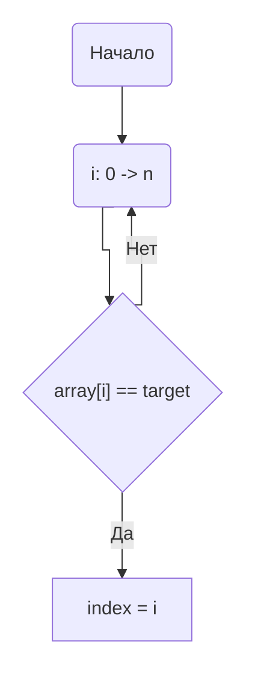

<h1>НИЯУ МИФИ. Лабораторная работа №2. Никифоров Степан, Б21-502. 2023</h1>


<h2>Используемая система</h2>

<pre>
                   -`                    defkit@archlinux
                  .o+`                   ----------------
                 `ooo/                   OS: Arch Linux x86_64
                `+oooo:                  Kernel: 6.4.12-arch1-1
               `+oooooo:                 Uptime: 2 hours, 22 mins
               -+oooooo+:                Packages: 1102 (pacman)
             `/:-:++oooo+:               Shell: bash 5.1.16
            `/++++/+++++++:              Resolution: 1920x1080
           `/++++++++++++++:             DE: GNOME 44.4
          `/+++ooooooooooooo/`           WM: Mutter
         ./ooosssso++osssssso+`          WM Theme: Adwaita
        .oossssso-````/ossssss+`         Theme: Adwaita [GTK2/3]
       -osssssso.      :ssssssso.        Icons: Adwaita [GTK2/3]
      :osssssss/        osssso+++.       Terminal: alacritty
     /ossssssss/        +ssssooo/-       Terminal Font: terminal-font
   `/ossssso+/:-        -:/+osssso+-     CPU: AMD Ryzen 7 5800X (16) @ 4.200GHz
  `+sso+:-`                 `.-/+oso:    GPU: NVIDIA GeForce GTX 1060 6GB
 `++:.                           `-/+/   Memory: 4355MiB / 15902MiB
</pre>
<h3>Среда разработки</h3>
<p>Язык программирования C</p>
<h3>Версия OpenMP</h3>
<ul>
    <li><b>gcc</b>:   20230801</li>
</ul>

<h3>Анализ алгоритма</h3>
<h3>Оценка временной сложности</h3>
<ul>
  <li><b>Лучший случай: </b>O(1)</li>
  <li><b>Худший случай: </b>O(n)</li>
  <li><b>Средний случай: </b>O(n)</li>
</ul>
<h4>Принцип работы</h4>
    Приведенный алгоритм итерируется по массиву чисел и сравнивает их с заданным элементом target. Если элемент массива оказывается равен target, то переменная index принимает значение индекса элемента массива

<h4>Блок-схема</h4>



<h4>Значение директив</h4>
<code>#pragma omp parallel num_threads(threads) shared(array, count) </code><br>
Задается параллельная обасть, с количеством потоков threads. Переменные <b>array</b> и <b>count</b> объявляются общими для всех потоков и непараллельной части алгоритма.<br>
<code>#pragma omp for</code><br>
Задается директива относящаяся к циклу for идущему сразу после нее, выполняется распараллеливагие цикла с дефолтным значением schedule.<br>
Область - <code>цикл for + array[i]=rand()</code><br>
Существует для оптимизации заполнения элементов массива.<br><br>


Область <code> #pragma omp parallel num_threads(threads) shared(array, count, target) reduction(max: index) default(none)</code><br>
Задается параллельная область, с количеством потоков threads. Переменные <b>array</b>, <b>count</b>, <b>target</b> объявляются общими для всех потоков и непараллельной части алгоритма. <br>
Это кто то читает?:(... и далее находится максимальный результат среди найденных при помощи редукции. Если ни один поток не нашел заданного элемента, то результат будет -1, тогда программа ничего не выведет. <br>
Если бы ее не было то цикл выполнился бы thread раз, каждый раз находя один и тот же максимальный элемент.<br>
<code>#pragma omp cancel for</code> нужна, для того чтобы параллельный алгоритм закончил свое выполнение, если был найден заданный элемент в массиве<br><br>
<h3>Ускорение и эффективность с использованием cancel for</h3>


<h3>Ускорение и эффективность без использования cancel for</h3>


<h3> Дополнительные вопросы</h3>
<h4> Почему график теоретической эффективность потока принимает такой вид?</h4>
Один процессор будет выполнять THREADS/SYS_MAX_PROCESSORS задач при THREADS >  SYS_MAX_PROCESSORS<br>
<h4> Почему экспериментальный график ускорения имеет пилообразную форму?</h4>
Пилообразная форма графика при THREADS > SYS_MAX_PROCESSORS обусловлена тем, что по теореме Дирихле, на каждое ядро будет разное количество потоков. <br>
То есть на некоторых ядрах будет THREADS // SYS_MAX_PROCESSORS потоков, а на других будет на один больше. <br>
Программа будет ждать завершения работы всех потоков, что приводит к замедлению в областях THREADS != SYS_MAX_PROCESSORS * n <br>
Так же время исполнения программы около 2ух милисекунд, может возникать погрешность "железа".<br>
По вышеуказанным причинам график ускорения имеет пилообразную форму<br><br>

<h3> Наблюдения </h3> 
<h4> Многопоточность в генерации массива</h4>
Не имеет смысла выделять потоки под инициализацию массива случайными числами, потому что у всех функций глобальный seed, а в random используется LCG<br>
То есть каждая следующая итерация рандома зависит от предыдущей, что плохо для многопоточности <br><br>
<h3>Заключение</h3>
В данной лабораторной работе была написана программа на языке С с использованием OpenMP, реализован параллельный цикл. По графикам видно, что после 8 потоков прекращается рост ускорения и эффективность каждого потока убывает примерно гиперболически<br>
<h3>Приложение</h3>
<h4>Оценка работы последовательной программы исполнялось при передачи одного потока в аргументы данной программы:</h4>

```c

#include <stdio.h>
#include <stdlib.h>
#include<sys/time.h>
long long timeInMilliseconds(void) {
    struct timeval tv;

    gettimeofday(&tv,NULL);
    return (((long long)tv.tv_sec)*1000)+(tv.tv_usec/1000);
}

long long main(int argc, char** argv)
{
  const int count = 100000000;     ///< Number of array elements
  const int target = 16;          ///< Number to look for

  int* array = 0;                 ///< The array we need to find the max in
  int  index = -1;                ///< The index of the element we need
  if (argc < 3){
    puts("USAGE ./a.out {THREADS_NUM} {SEED}");
    return -1;
  }
  const int threads = atoi(argv[1]);         ///< Number of parallel threads to use
  const int random_seed = atoi(argv[2]); ///< RNG seed

  /* Initialize the RNG */
  srand(random_seed);

  /* Generate the random array */

  /*
   * We can multithread array filling
   * */

  array = (int*)malloc(count*sizeof(int));
  #pragma omp parallel num_threads(threads) shared(array, count)
  { 
    #pragma omp for
    for(int i=0; i<count; i++){ 
      array[i] = rand(); 
    }
  }

  /* Find the index of the element */
  /*
   * We can multithread index finding
   * */
  

  long long time_start = timeInMilliseconds();
  #pragma omp parallel num_threads(threads) shared(array, count, target) reduction(max: index) default(none)
  {
    #pragma omp for
    for(int i=0; i<count; i++)
    {   
        if(array[i] == target)
        {
            index = i;
            #pragma omp cancel for
        }
    }
  }
  free(array);
  if(index != -1){
    printf("Found occurence of %d at index %d;\n", target, index);
  }
  return timeInMilliseconds() - time_start;
}
```
```
