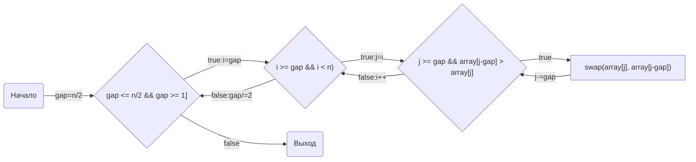
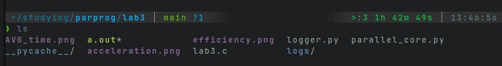
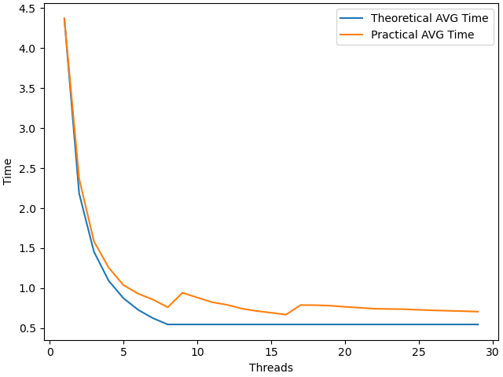
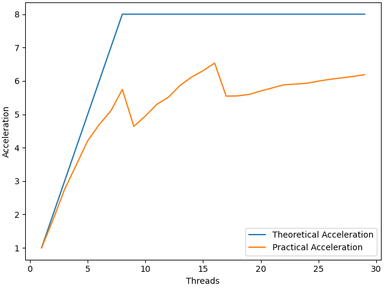
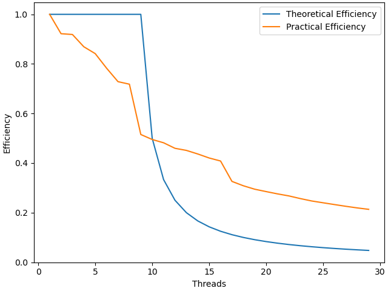

# НИЯУ МИФИ. Лабораторная работа №3. Никифоров Степан, Б21-502. 2023.
## Среда разработки
<pre>
                   -`                    defkit@archlinux
                  .o+`                   ----------------
                 `ooo/                   OS: Arch Linux x86_64
                `+oooo:                  Kernel: 6.4.12-arch1-1
               `+oooooo:                 Uptime: 2 hours, 22 mins
               -+oooooo+:                Packages: 1102 (pacman)
             `/:-:++oooo+:               Shell: bash 5.1.16
            `/++++/+++++++:              Resolution: 1920x1080
           `/++++++++++++++:             DE: GNOME 44.4
          `/+++ooooooooooooo/`           WM: Mutter
         ./ooosssso++osssssso+`          WM Theme: Adwaita
        .oossssso-````/ossssss+`         Theme: Adwaita [GTK2/3]
       -osssssso.      :ssssssso.        Icons: Adwaita [GTK2/3]
      :osssssss/        osssso+++.       Terminal: alacritty
     /ossssssss/        +ssssooo/-       Terminal Font: terminal-font
   `/ossssso+/:-        -:/+osssso+-     CPU: AMD Ryzen 7 5800X (16) @ 4.200GHz
  `+sso+:-`                 `.-/+oso:    GPU: NVIDIA GeForce GTX 1060 6GB
 `++:.                           `-/+/   Memory: 4355MiB / 15902MiB
</pre>

## Временная оценка алгоритма
- Лучший случай O(n*log(n)) - если массив уже отсортирован
- Худший случай O(n^2) - когда последний вложенный цикл выполняется полностью(что никогда не происходит)

## Анализ алгоритма
#### Принцип работы

#### Блок-схема




## Значение директив
<code>
#pragma omp parallel for shared(gap, count, array) private(i, j, tmp, part) default(none) num_threads(threads)
</code>

Задается обасть параллельного цикла, с количеством тредов <code>threads</code>. Переменные <code>array</code>, <code>count</code> и <code>gap</code> объявляются общими для всех тредов и непараллельной части алгоритма. Все новые переменные без явного указания класса не разрешены. Переменные <code>i</code>, <code>j</code>, <code>tmp</code> и <code>part</code> объявляется индивидуальной для каждого треда.
Область - <code>цикл for</code>

Эта директива необходима для распараллеливания сортировки элементов массива, которые отстоят друг от друга на расстоянии <code>gap</code>, потому что они не пересекаются с остальными и соответственно уменьшения время всей сортировки.


## Параллельный алгоритм
200 раз генерируется случайный массив из ста тысяч элементов с разным сидом, чтобы усреднить худшие и лучшие случаи.<br>
Всего эксперимент занял два часа <br>
<br>

## Блок схема

### Среднее время



### Среднее ускорение

### Средняя эффективность



## Заключение
В данной работе я разработал и реализовал параллельный алгоритм сортировки Шелла. Ускорение возможно, потому что во втором вложенном цикле происходят сортировки пузырьком для элементов отстающих друг от друга на фиксированную величину <code>gap</code>, а следовательно все элементы, стоящие на индексах <code>0..gap-1</code>, образуют непересекающиеся множества.

Анализ графиков показал, что:
- Как и ожидалось, после 16 потоков ускорения не происходит.
- 


## Приложение
### Оценка работы последовательной программы
```c
            for(int j=i; j>=gap  && array[j-gap] > array[j]; j-=gap){
                int tmp = array[j];
                array[j] = array[j-gap];
                array[j-gap] = tmp;
            }
        }
    }
    t2 = omp_get_wtime();
    return t2 - t1;
}
 

int main(){
    int count = 100000;
    unsigned int random_seed = 1337;
    const int num_exp = 10;
    
    int**arrays = NULL;
    int* array = NULL;

    arrays = (int**)calloc(num_exp, sizeof(int*));
    for(int t = 0; t < num_exp; t++){
        arrays[t] = (int*)calloc(count, sizeof(int));
        new_array(arrays[t], &random_seed, count);
    }

    double t1, t2, res = 0.0;
    for(int e = 0; e < num_exp; e++){ 
        fprintf(stderr, "Number of experiment: %d/%d\n", e+1, num_exp);
        array = arrays[e];
        res += shellsort(array, count);
    }
//    printf("Num of iterations: %d, count: %d\n", r, count);
    res /= (double)(num_exp);
    fprintf(stdout, "%g", res); 

    for(int t = 0; t < num_exp; t++){
        free(arrays[t]);
    }
    free(arrays);
    return 0;
}

```
### Оценка работы параллельной программы

```c
#include <omp.h>
#include <stdio.h>

double shellsort(int* array, int count, int threads){
    double t1, t2;
    int i, j, tmp, part;
    t1 = omp_get_wtime();
    for(int gap = count/2; gap > 0; gap /= 2){
        #pragma omp parallel for shared(gap, count, array) private(i, j, tmp, part) default(none) num_threads(threads)
        for(i = 0; i < gap; i++){
            for(part = i + gap; part < count; part += gap){
                for(j=part; j>i  && array[j-gap] > array[j]; j-=gap){
                    tmp = array[j];
                    array[j] = array[j-gap];
                    array[j-gap] = tmp;
                }
            }
        }
    }
    t2 = omp_get_wtime();
    return t2 - t1;
}

int main(int argc, char** argv)
{
  const int count = 10000000;     ///< Number of array elements
  const int target = 16;          ///< Number to look for

  int* array = 0;                 ///< The array we need to find the max in
  int  index = -1;                ///< The index of the element we need
  if (argc < 3){
    puts("USAGE ./a.out {THREADS_NUM} {SEED}");
    return -1;
  }
  const int threads = atoi(argv[1]);         ///< Number of parallel threads to use
  const int random_seed = atoi(argv[2]); ///< RNG seed

  /* Initialize the RNG */
  srand(random_seed);

  /* Generate the random array */

  /*
   * We can multithread array filling
   * */

  array = (int*)malloc(count*sizeof(int));
  for(int i=0; i<count; i++){ 
    array[i] = rand(); 
  }
  double t = shellsort(array, count, threads);
  printf("%g", t);

  return 0;
}
```
