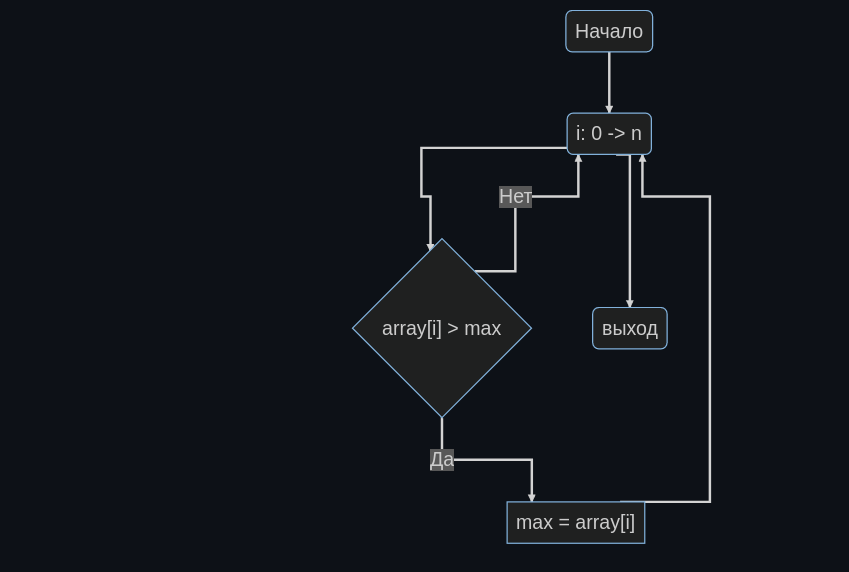
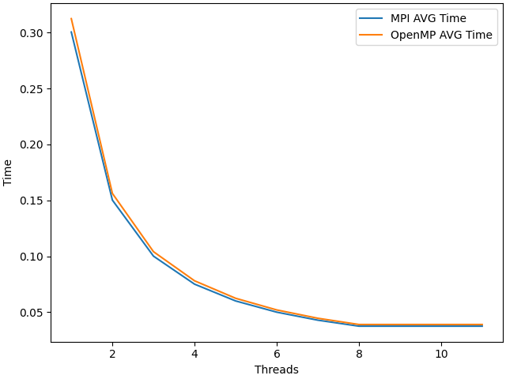
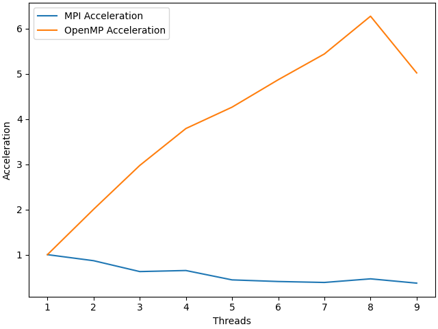
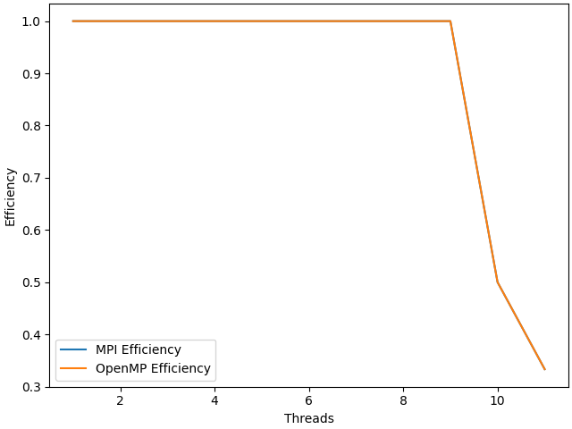

# НИЯУ МИФИ. Лабораторная работа №4. Никифоров Степан, Б21-502. 2023.
## Среда разработки
```
            .-/+oossssoo+/-.               defkit@parprog
        `:+ssssssssssssssssss+:`           --------------
      -+ssssssssssssssssssyyssss+-         OS: Ubuntu 22.04.3 LTS x86_64
    .ossssssssssssssssssdMMMNysssso.       Host: xeon-gold-6338 pc-q35-yc-2.12
   /ssssssssssshdmmNNmmyNMMMMhssssss/      Kernel: 5.15.0-91-generic
  +ssssssssshmydMMMMMMMNddddyssssssss+     Uptime: 1 hour, 55 mins
 /sssssssshNMMMyhhyyyyhmNMMMNhssssssss/    Packages: 784 (dpkg), 4 (snap)
.ssssssssdMMMNhsssssssssshNMMMdssssssss.   Shell: bash 5.1.16
+sssshhhyNMMNyssssssssssssyNMMMysssssss+   Resolution: 1024x768
ossyNMMMNyMMhsssssssssssssshmmmhssssssso   Terminal: /dev/pts/1
ossyNMMMNyMMhsssssssssssssshmmmhssssssso   CPU: Intel Xeon (Icelake) (8) @ 1.995GHz
+sssshhhyNMMNyssssssssssssyNMMMysssssss+   GPU: 00:01.0 Vendor 1234 Device 1111
.ssssssssdMMMNhsssssssssshNMMMdssssssss.   Memory: 240MiB / 15987MiB
 /sssssssshNMMMyhhyyyyhdNMMMNhssssssss/
  +sssssssssdmydMMMMMMMMddddyssssssss+
   /ssssssssssshdmNNNNmyNMMMMhssssss/
    .ossssssssssssssssssdMMMNysssso.
      -+sssssssssssssssssyyyssss+-
        `:+ssssssssssssssssss+:`
            .-/+oossssoo+/-.
```

## Информация об MPI
mpich == 4.0<br>
## Блок-схема алгоритма
<br>

## Временная оценка алгоритма
$O(n/p)$<br>

n - число элементов в массиве<br>
p - число используемых потоков<br>

## Экспериментальные вычисления
### Среднее время
<br>

### Среднее ускорение
<br>
### Средняя эффективность

<br>

## Заключение
В данной лабораторной работе была настроена среда, написана первая программа с использованием технологий MPI и был проведен сравнительный анализ программы с использованием MPI и аналогичной с использованием OpenMP<br>
В результате анализа графиков, стало понятно, что MPI тратит больше времени на пересылку данных между процессами, поэтому время работы MPI в среднем дольше. Однако программа очень примитивна, из этого нельзя делать какие либо выводы. <br>

## Приложение
### Оценка работы параллельной программы
```c
#include <stdlib.h>
#include <stdio.h>
#include <mpi.h>
#include <omp.h>

int main(int argc, char** argv)
{
	int ret  = -1;	///< For return values
	int size = -1;	///< Total number of processors
	int rank = -1;	///< This processor's number

	const int count = 100000000;; ///< Number of array elements

	int* array = 0; ///< The array we need to find the max in
	int lmax = -1;	///< Local maximums
	int  max = -1;  ///< The maximal element
  double start, end;

  const int random_seed = atoi(argv[1]); ///< RNG seed
	/* Initialize the MPI */
	ret = MPI_Init(&argc, &argv);

	/* Determine our rank and processor count */
	MPI_Comm_size(MPI_COMM_WORLD, &size);
	MPI_Comm_rank(MPI_COMM_WORLD, &rank);

	/* Allocate the array */
  array = (int*)malloc(count * sizeof(int));
  if(!rank){
    srand(random_seed);
    for (int i = 0; i < count; i++) { array[i] = rand(); }
  }
    
  start = MPI_Wtime();
	MPI_Bcast(array, count, MPI_INTEGER, 0, MPI_COMM_WORLD);

	const int wstart = (rank    ) * count / size;
	const int wend   = (rank + 1) * count / size;

	for (int i = wstart; i < wend; i++){
		if (array[i] > lmax){ 
            lmax = array[i]; 
      }
	}

	MPI_Reduce(&lmax, &max, 1, MPI_INTEGER, MPI_MAX, 0, MPI_COMM_WORLD);
	  end = MPI_Wtime();
	ret = MPI_Finalize();
  if (!rank) {
    printf("%g\n", end-start);
  }
	return(0);
}
``` <br>

### Программа для запуска и анализа данных
```py

from random import randrange
import subprocess
from logger import logger
import matplotlib.pyplot as plt
from abc import ABC

AVG_RUNS = 5
MAX_SYSTEM_THREADS = 8
MAX_TEST_THREAD = 12


class ParallelExecutor:
    def __init__(self, program_name: str) -> None:
        self.program = program_name

    def __average_for_n_threads(self, threads_num: int) -> float:
        timings = []
        for _ in range(AVG_RUNS):
            seed = randrange(0, 2**16)
            p = subprocess.run([self.program, str(threads_num), str(seed)], stdout=subprocess.PIPE)
            out = p.stdout
            timings.append(float(out.strip()))
            logger.info(f"subprocess with {threads_num} threads finished with timing {out}")

        return sum(timings) / len(timings)

    def __average_for_n_threads_mpi(self, threads_num: int) -> float:
        timings = []
        for _ in range(AVG_RUNS):
            seed = randrange(0, 2**16)
            p = subprocess.run(['mpirun', '--hostfile', 'hostfile', '-n', str(threads_num),'./lab5',  str(seed)], stdout=subprocess.PIPE)
            out = p.stdout
            timings.append(float(out.strip()))
            logger.info(f"subprocess with mpi {threads_num} threads finished with timing {out}")

        return sum(timings) / len(timings)

    def get_graph_experemental_info(self, mpi=False):
        func = self.__average_for_n_threads_mpi if mpi else self.__average_for_n_threads
        graph_data = []
        for thread_num in range(1, MAX_TEST_THREAD):
            point = [thread_num, func(thread_num)]
            graph_data.append(point)

        return graph_data


class ABCDataCore(ABC):
    def __init__(self, plot_data):
        self.experimental_data = plot_data

    def theoretical_average_time(self, x: int):
        pass

    def theoretical_efficiency(self, x: int):
        pass

    def theoretical_acceleration(self, x: int):
        pass

    def load_theoretical_average_time(self):
        x = [i[0] for i in self.experimental_data]
        y = [self.theoretical_average_time(i) for i in x]
        return x, y

    def load_theoretical_efficiency(self):
        x = [i[0] for i in self.experimental_data]
        y = [self.theoretical_efficiency(i) for i in x]
        return x, y

    def load_theoretical_acceleration(self):
        x = [i[0] for i in self.experimental_data]
        y = [self.theoretical_acceleration(i) for i in x]
        return x, y

    def load_practical_average_time(self):
        pass

    def load_practical_efficiency(self):
        pass

    def load_practical_acceleration(self):
        pass


class Lab1DataCore(ABCDataCore):
    def theoretical_average_time(self, x):
        base_point = self.experimental_data[0][1]
        if x < MAX_SYSTEM_THREADS:
            return base_point/x
        return base_point / MAX_SYSTEM_THREADS

    def theoretical_efficiency(self, x):
        if x <= MAX_SYSTEM_THREADS:
            return 1
        return 1/(x - MAX_SYSTEM_THREADS)

    def theoretical_acceleration(self, x):
        if x <= MAX_SYSTEM_THREADS:
            return x 
        return MAX_SYSTEM_THREADS

    def load_practical_average_time(self):
        x = [i[0] for i in self.experimental_data]
        y = [i[1] for i in self.experimental_data]
        return x, y

    def load_practical_efficiency(self):
        base_point = self.experimental_data[0][1]
        x = [i[0] for i in self.experimental_data]
        y = [base_point/(i[1]*i[0])for i in self.experimental_data]
        return x, y

    def load_practical_acceleration(self):
        base_point = self.experimental_data[0][1]
        x = [i[0] for i in self.experimental_data]
        y = [base_point/i[1] for i in self.experimental_data]
        return x, y


class Visualizer:
    def __init__(self, binary_name: str, binary_name2: str):
        self.executor = ParallelExecutor(binary_name)
        self.executor2 = ParallelExecutor(binary_name2)
        self.experimental_data2 = self.executor2.get_graph_experemental_info(mpi=True)
        self.experimental_data = self.executor.get_graph_experemental_info()
        self.data_core = Lab1DataCore(self.experimental_data)
        self.data_core2 = Lab1DataCore(self.experimental_data2)

    def visualize_average_time(self, name="AVG_time.png"):
        xt, yt = self.data_core2.load_practical_average_time()
        xp, yp = self.data_core.load_practical_average_time()
        fig, ax = plt.subplots(layout='constrained')
        ax.plot(xt, yt, label="MPI AVG Time")
        ax.plot(xp, yp, label="OpenMP AVG Time")
        ax.set_xlabel("Threads")
        ax.set_ylabel("Time")
        ax.legend()
        fig.savefig(name)

    def visualize_acceleration(self, name="acceleration.png"):
        xt, yt = self.data_core2.load_practical_acceleration()
        xp, yp = self.data_core.load_practical_acceleration()
        fig, ax = plt.subplots(layout='constrained')
        ax.plot(xt, yt, label="MPI Acceleration")
        ax.plot(xp, yp, label="OpenMP Acceleration")
        ax.set_xlabel("Threads")
        ax.set_ylabel("Acceleration")
        ax.legend()
        fig.savefig(name)

    def visualize_efficiency(self, name="efficiency.png"):
        xt, yt = self.data_core2.load_practical_efficiency()
        xp, yp = self.data_core.load_practical_efficiency()
        fig, ax = plt.subplots(layout='constrained')
        ax.plot(xt, yt, label="MPI Efficiency")
        ax.plot(xp, yp, label="OpenMP Efficiency")
        ax.set_xlabel("Threads")
        ax.set_ylabel("Efficiency")
        ax.legend()
        fig.savefig(name)


def main():
    v = Visualizer('./lab1', './lab5')
    v.visualize_average_time()
    v.visualize_efficiency()
    v.visualize_acceleration()

if __name__ == "__main__":
    main()

```

### Результаты измерений
```

2023-12-11 19:38:13.403 | INFO     | None | __main__:__average_for_n_threads_mpi:34 - subprocess with mpi 1 threads finished with timing b'0.310039\n'
2023-12-11 19:38:16.097 | INFO     | None | __main__:__average_for_n_threads_mpi:34 - subprocess with mpi 1 threads finished with timing b'0.313379\n'
2023-12-11 19:38:18.809 | INFO     | None | __main__:__average_for_n_threads_mpi:34 - subprocess with mpi 1 threads finished with timing b'0.313035\n'
2023-12-11 19:38:21.511 | INFO     | None | __main__:__average_for_n_threads_mpi:34 - subprocess with mpi 1 threads finished with timing b'0.312525\n'
2023-12-11 19:38:24.240 | INFO     | None | __main__:__average_for_n_threads_mpi:34 - subprocess with mpi 1 threads finished with timing b'0.315008\n'
2023-12-11 19:38:26.943 | INFO     | None | __main__:__average_for_n_threads_mpi:34 - subprocess with mpi 1 threads finished with timing b'0.310428\n'
2023-12-11 19:38:29.625 | INFO     | None | __main__:__average_for_n_threads_mpi:34 - subprocess with mpi 1 threads finished with timing b'0.309468\n'
2023-12-11 19:38:32.327 | INFO     | None | __main__:__average_for_n_threads_mpi:34 - subprocess with mpi 1 threads finished with timing b'0.313175\n'
2023-12-11 19:38:35.028 | INFO     | None | __main__:__average_for_n_threads_mpi:34 - subprocess with mpi 1 threads finished with timing b'0.313389\n'
2023-12-11 19:38:37.726 | INFO     | None | __main__:__average_for_n_threads_mpi:34 - subprocess with mpi 1 threads finished with timing b'0.314533\n'
2023-12-11 19:38:40.553 | INFO     | None | __main__:__average_for_n_threads_mpi:34 - subprocess with mpi 2 threads finished with timing b'0.349909\n'
2023-12-11 19:38:43.335 | INFO     | None | __main__:__average_for_n_threads_mpi:34 - subprocess with mpi 2 threads finished with timing b'0.34819\n'
2023-12-11 19:38:46.107 | INFO     | None | __main__:__average_for_n_threads_mpi:34 - subprocess with mpi 2 threads finished with timing b'0.343448\n'
2023-12-11 19:38:48.861 | INFO     | None | __main__:__average_for_n_threads_mpi:34 - subprocess with mpi 2 threads finished with timing b'0.344181\n'
2023-12-11 19:38:51.650 | INFO     | None | __main__:__average_for_n_threads_mpi:34 - subprocess with mpi 2 threads finished with timing b'0.348979\n'
2023-12-11 19:38:54.406 | INFO     | None | __main__:__average_for_n_threads_mpi:34 - subprocess with mpi 2 threads finished with timing b'0.340782\n'
2023-12-11 19:38:57.186 | INFO     | None | __main__:__average_for_n_threads_mpi:34 - subprocess with mpi 2 threads finished with timing b'0.344409\n'
2023-12-11 19:38:59.970 | INFO     | None | __main__:__average_for_n_threads_mpi:34 - subprocess with mpi 2 threads finished with timing b'0.346702\n'
2023-12-11 19:39:02.769 | INFO     | None | __main__:__average_for_n_threads_mpi:34 - subprocess with mpi 2 threads finished with timing b'0.344717\n'
2023-12-11 19:39:05.580 | INFO     | None | __main__:__average_for_n_threads_mpi:34 - subprocess with mpi 2 threads finished with timing b'0.345581\n'
2023-12-11 19:39:08.509 | INFO     | None | __main__:__average_for_n_threads_mpi:34 - subprocess with mpi 3 threads finished with timing b'0.482794\n'
2023-12-11 19:39:11.473 | INFO     | None | __main__:__average_for_n_threads_mpi:34 - subprocess with mpi 3 threads finished with timing b'0.483505\n'
2023-12-11 19:39:14.457 | INFO     | None | __main__:__average_for_n_threads_mpi:34 - subprocess with mpi 3 threads finished with timing b'0.483531\n'
2023-12-11 19:39:17.441 | INFO     | None | __main__:__average_for_n_threads_mpi:34 - subprocess with mpi 3 threads finished with timing b'0.480019\n'
2023-12-11 19:39:20.387 | INFO     | None | __main__:__average_for_n_threads_mpi:34 - subprocess with mpi 3 threads finished with timing b'0.483728\n'
2023-12-11 19:39:23.365 | INFO     | None | __main__:__average_for_n_threads_mpi:34 - subprocess with mpi 3 threads finished with timing b'0.482468\n'
2023-12-11 19:39:26.325 | INFO     | None | __main__:__average_for_n_threads_mpi:34 - subprocess with mpi 3 threads finished with timing b'0.489712\n'
2023-12-11 19:39:29.330 | INFO     | None | __main__:__average_for_n_threads_mpi:34 - subprocess with mpi 3 threads finished with timing b'0.48913\n'
2023-12-11 19:39:32.387 | INFO     | None | __main__:__average_for_n_threads_mpi:34 - subprocess with mpi 3 threads finished with timing b'0.498705\n'
2023-12-11 19:39:35.396 | INFO     | None | __main__:__average_for_n_threads_mpi:34 - subprocess with mpi 3 threads finished with timing b'0.489561\n'
2023-12-11 19:39:38.400 | INFO     | None | __main__:__average_for_n_threads_mpi:34 - subprocess with mpi 4 threads finished with timing b'0.471778\n'
2023-12-11 19:39:41.429 | INFO     | None | __main__:__average_for_n_threads_mpi:34 - subprocess with mpi 4 threads finished with timing b'0.476371\n'
2023-12-11 19:39:44.409 | INFO     | None | __main__:__average_for_n_threads_mpi:34 - subprocess with mpi 4 threads finished with timing b'0.465749\n'
2023-12-11 19:39:47.398 | INFO     | None | __main__:__average_for_n_threads_mpi:34 - subprocess with mpi 4 threads finished with timing b'0.468284\n'
2023-12-11 19:39:50.381 | INFO     | None | __main__:__average_for_n_threads_mpi:34 - subprocess with mpi 4 threads finished with timing b'0.462945\n'
2023-12-11 19:39:53.357 | INFO     | None | __main__:__average_for_n_threads_mpi:34 - subprocess with mpi 4 threads finished with timing b'0.467922\n'
2023-12-11 19:39:56.324 | INFO     | None | __main__:__average_for_n_threads_mpi:34 - subprocess with mpi 4 threads finished with timing b'0.467311\n'
2023-12-11 19:39:59.257 | INFO     | None | __main__:__average_for_n_threads_mpi:34 - subprocess with mpi 4 threads finished with timing b'0.460483\n'
2023-12-11 19:40:02.209 | INFO     | None | __main__:__average_for_n_threads_mpi:34 - subprocess with mpi 4 threads finished with timing b'0.474831\n'
2023-12-11 19:40:05.201 | INFO     | None | __main__:__average_for_n_threads_mpi:34 - subprocess with mpi 4 threads finished with timing b'0.470484\n'
2023-12-11 19:40:08.524 | INFO     | None | __main__:__average_for_n_threads_mpi:34 - subprocess with mpi 5 threads finished with timing b'0.754432\n'
2023-12-11 19:40:12.792 | INFO     | None | __main__:__average_for_n_threads_mpi:34 - subprocess with mpi 5 threads finished with timing b'0.72312\n'
2023-12-11 19:40:16.099 | INFO     | None | __main__:__average_for_n_threads_mpi:34 - subprocess with mpi 5 threads finished with timing b'0.750147\n'
2023-12-11 19:40:19.372 | INFO     | None | __main__:__average_for_n_threads_mpi:34 - subprocess with mpi 5 threads finished with timing b'0.753885\n'
2023-12-11 19:40:22.653 | INFO     | None | __main__:__average_for_n_threads_mpi:34 - subprocess with mpi 5 threads finished with timing b'0.719151\n'
2023-12-11 19:40:25.950 | INFO     | None | __main__:__average_for_n_threads_mpi:34 - subprocess with mpi 5 threads finished with timing b'0.750474\n'
2023-12-11 19:40:30.230 | INFO     | None | __main__:__average_for_n_threads_mpi:34 - subprocess with mpi 5 threads finished with timing b'0.715146\n'
2023-12-11 19:40:34.535 | INFO     | None | __main__:__average_for_n_threads_mpi:34 - subprocess with mpi 5 threads finished with timing b'0.71382\n'
2023-12-11 19:40:38.896 | INFO     | None | __main__:__average_for_n_threads_mpi:34 - subprocess with mpi 5 threads finished with timing b'0.706348\n'
2023-12-11 19:40:42.200 | INFO     | None | __main__:__average_for_n_threads_mpi:34 - subprocess with mpi 5 threads finished with timing b'0.765144\n'
2023-12-11 19:40:45.919 | INFO     | None | __main__:__average_for_n_threads_mpi:34 - subprocess with mpi 6 threads finished with timing b'0.752352\n'
2023-12-11 19:40:50.253 | INFO     | None | __main__:__average_for_n_threads_mpi:34 - subprocess with mpi 6 threads finished with timing b'0.751024\n'
2023-12-11 19:40:53.565 | INFO     | None | __main__:__average_for_n_threads_mpi:34 - subprocess with mpi 6 threads finished with timing b'0.775633\n'
2023-12-11 19:40:56.936 | INFO     | None | __main__:__average_for_n_threads_mpi:34 - subprocess with mpi 6 threads finished with timing b'0.827851\n'
2023-12-11 19:41:00.286 | INFO     | None | __main__:__average_for_n_threads_mpi:34 - subprocess with mpi 6 threads finished with timing b'0.816571\n'
2023-12-11 19:41:03.636 | INFO     | None | __main__:__average_for_n_threads_mpi:34 - subprocess with mpi 6 threads finished with timing b'0.806668\n'
2023-12-11 19:41:06.976 | INFO     | None | __main__:__average_for_n_threads_mpi:34 - subprocess with mpi 6 threads finished with timing b'0.801675\n'
2023-12-11 19:41:10.274 | INFO     | None | __main__:__average_for_n_threads_mpi:34 - subprocess with mpi 6 threads finished with timing b'0.773756\n'
2023-12-11 19:41:14.562 | INFO     | None | __main__:__average_for_n_threads_mpi:34 - subprocess with mpi 6 threads finished with timing b'0.702103\n'
2023-12-11 19:41:18.906 | INFO     | None | __main__:__average_for_n_threads_mpi:34 - subprocess with mpi 6 threads finished with timing b'0.717656\n'
2023-12-11 19:41:23.319 | INFO     | None | __main__:__average_for_n_threads_mpi:34 - subprocess with mpi 7 threads finished with timing b'0.813031\n'
2023-12-11 19:41:27.755 | INFO     | None | __main__:__average_for_n_threads_mpi:34 - subprocess with mpi 7 threads finished with timing b'0.799017\n'
2023-12-11 19:41:32.230 | INFO     | None | __main__:__average_for_n_threads_mpi:34 - subprocess with mpi 7 threads finished with timing b'0.821215\n'
2023-12-11 19:41:36.569 | INFO     | None | __main__:__average_for_n_threads_mpi:34 - subprocess with mpi 7 threads finished with timing b'0.747825\n'
2023-12-11 19:41:40.934 | INFO     | None | __main__:__average_for_n_threads_mpi:34 - subprocess with mpi 7 threads finished with timing b'0.788297\n'
2023-12-11 19:41:45.312 | INFO     | None | __main__:__average_for_n_threads_mpi:34 - subprocess with mpi 7 threads finished with timing b'0.761167\n'
2023-12-11 19:41:48.759 | INFO     | None | __main__:__average_for_n_threads_mpi:34 - subprocess with mpi 7 threads finished with timing b'0.841401\n'
2023-12-11 19:41:52.180 | INFO     | None | __main__:__average_for_n_threads_mpi:34 - subprocess with mpi 7 threads finished with timing b'0.830267\n'
2023-12-11 19:41:56.523 | INFO     | None | __main__:__average_for_n_threads_mpi:34 - subprocess with mpi 7 threads finished with timing b'0.7832\n'
2023-12-11 19:42:00.897 | INFO     | None | __main__:__average_for_n_threads_mpi:34 - subprocess with mpi 7 threads finished with timing b'0.817814\n'
2023-12-11 19:42:05.151 | INFO     | None | __main__:__average_for_n_threads_mpi:34 - subprocess with mpi 8 threads finished with timing b'0.633693\n'
2023-12-11 19:42:09.354 | INFO     | None | __main__:__average_for_n_threads_mpi:34 - subprocess with mpi 8 threads finished with timing b'0.630275\n'
2023-12-11 19:42:13.623 | INFO     | None | __main__:__average_for_n_threads_mpi:34 - subprocess with mpi 8 threads finished with timing b'0.650043\n'
2023-12-11 19:42:17.798 | INFO     | None | __main__:__average_for_n_threads_mpi:34 - subprocess with mpi 8 threads finished with timing b'0.62061\n'
2023-12-11 19:42:22.110 | INFO     | None | __main__:__average_for_n_threads_mpi:34 - subprocess with mpi 8 threads finished with timing b'0.668717\n'
2023-12-11 19:42:26.409 | INFO     | None | __main__:__average_for_n_threads_mpi:34 - subprocess with mpi 8 threads finished with timing b'0.637347\n'
2023-12-11 19:42:30.724 | INFO     | None | __main__:__average_for_n_threads_mpi:34 - subprocess with mpi 8 threads finished with timing b'0.650876\n'
2023-12-11 19:42:35.009 | INFO     | None | __main__:__average_for_n_threads_mpi:34 - subprocess with mpi 8 threads finished with timing b'0.655627\n'
2023-12-11 19:42:39.287 | INFO     | None | __main__:__average_for_n_threads_mpi:34 - subprocess with mpi 8 threads finished with timing b'0.658178\n'
2023-12-11 19:42:43.536 | INFO     | None | __main__:__average_for_n_threads_mpi:34 - subprocess with mpi 8 threads finished with timing b'0.640126\n'
2023-12-11 19:42:48.951 | INFO     | None | __main__:__average_for_n_threads_mpi:34 - subprocess with mpi 9 threads finished with timing b'1.01112\n'
2023-12-11 19:42:54.334 | INFO     | None | __main__:__average_for_n_threads_mpi:34 - subprocess with mpi 9 threads finished with timing b'1.10191\n'
2023-12-11 19:42:59.696 | INFO     | None | __main__:__average_for_n_threads_mpi:34 - subprocess with mpi 9 threads finished with timing b'0.94529\n'
2023-12-11 19:43:04.906 | INFO     | None | __main__:__average_for_n_threads_mpi:34 - subprocess with mpi 9 threads finished with timing b'0.893363\n'
2023-12-11 19:43:09.980 | INFO     | None | __main__:__average_for_n_threads_mpi:34 - subprocess with mpi 9 threads finished with timing b'0.872894\n'
2023-12-11 19:43:15.469 | INFO     | None | __main__:__average_for_n_threads_mpi:34 - subprocess with mpi 9 threads finished with timing b'0.971103\n'
2023-12-11 19:43:21.124 | INFO     | None | __main__:__average_for_n_threads_mpi:34 - subprocess with mpi 9 threads finished with timing b'1.03953\n'
2023-12-11 19:43:26.468 | INFO     | None | __main__:__average_for_n_threads_mpi:34 - subprocess with mpi 9 threads finished with timing b'0.888586\n'
2023-12-11 19:43:31.936 | INFO     | None | __main__:__average_for_n_threads_mpi:34 - subprocess with mpi 9 threads finished with timing b'1.35268\n'
2023-12-11 19:43:37.140 | INFO     | None | __main__:__average_for_n_threads_mpi:34 - subprocess with mpi 9 threads finished with timing b'0.931667\n'
2023-12-11 19:43:43.596 | INFO     | None | __main__:__average_for_n_threads_mpi:34 - subprocess with mpi 10 threads finished with timing b'1.22058\n'
2023-12-11 19:43:50.610 | INFO     | None | __main__:__average_for_n_threads_mpi:34 - subprocess with mpi 10 threads finished with timing b'1.39345\n'
2023-12-11 19:43:56.964 | INFO     | None | __main__:__average_for_n_threads_mpi:34 - subprocess with mpi 10 threads finished with timing b'1.04762\n'
2023-12-11 19:44:03.127 | INFO     | None | __main__:__average_for_n_threads_mpi:34 - subprocess with mpi 10 threads finished with timing b'1.36022\n'
2023-12-11 19:44:09.120 | INFO     | None | __main__:__average_for_n_threads_mpi:34 - subprocess with mpi 10 threads finished with timing b'1.10611\n'
2023-12-11 19:44:15.428 | INFO     | None | __main__:__average_for_n_threads_mpi:34 - subprocess with mpi 10 threads finished with timing b'1.34476\n'
2023-12-11 19:44:21.642 | INFO     | None | __main__:__average_for_n_threads_mpi:34 - subprocess with mpi 10 threads finished with timing b'1.47175\n'
2023-12-11 19:44:28.012 | INFO     | None | __main__:__average_for_n_threads_mpi:34 - subprocess with mpi 10 threads finished with timing b'1.15617\n'
2023-12-11 19:44:34.604 | INFO     | None | __main__:__average_for_n_threads_mpi:34 - subprocess with mpi 10 threads finished with timing b'1.15373\n'
2023-12-11 19:44:40.593 | INFO     | None | __main__:__average_for_n_threads_mpi:34 - subprocess with mpi 10 threads finished with timing b'1.31353\n'
2023-12-11 19:44:48.113 | INFO     | None | __main__:__average_for_n_threads_mpi:34 - subprocess with mpi 11 threads finished with timing b'1.5101\n'
2023-12-11 19:44:55.131 | INFO     | None | __main__:__average_for_n_threads_mpi:34 - subprocess with mpi 11 threads finished with timing b'1.71864\n'
2023-12-11 19:45:01.729 | INFO     | None | __main__:__average_for_n_threads_mpi:34 - subprocess with mpi 11 threads finished with timing b'1.463\n'
2023-12-11 19:45:08.526 | INFO     | None | __main__:__average_for_n_threads_mpi:34 - subprocess with mpi 11 threads finished with timing b'1.38125\n'
2023-12-11 19:45:15.453 | INFO     | None | __main__:__average_for_n_threads_mpi:34 - subprocess with mpi 11 threads finished with timing b'1.35742\n'
2023-12-11 19:45:22.424 | INFO     | None | __main__:__average_for_n_threads_mpi:34 - subprocess with mpi 11 threads finished with timing b'1.4611\n'
2023-12-11 19:45:29.185 | INFO     | None | __main__:__average_for_n_threads_mpi:34 - subprocess with mpi 11 threads finished with timing b'1.30391\n'
2023-12-11 19:45:36.247 | INFO     | None | __main__:__average_for_n_threads_mpi:34 - subprocess with mpi 11 threads finished with timing b'1.41582\n'
2023-12-11 19:45:42.824 | INFO     | None | __main__:__average_for_n_threads_mpi:34 - subprocess with mpi 11 threads finished with timing b'1.48093\n'
2023-12-11 19:45:49.808 | INFO     | None | __main__:__average_for_n_threads_mpi:34 - subprocess with mpi 11 threads finished with timing b'1.46373\n'
2023-12-11 19:45:52.248 | INFO     | None | __main__:__average_for_n_threads:23 - subprocess with 1 threads finished with timing b'0.295391'
2023-12-11 19:45:54.697 | INFO     | None | __main__:__average_for_n_threads:23 - subprocess with 1 threads finished with timing b'0.300151'
2023-12-11 19:45:57.145 | INFO     | None | __main__:__average_for_n_threads:23 - subprocess with 1 threads finished with timing b'0.296785'
2023-12-11 19:45:59.586 | INFO     | None | __main__:__average_for_n_threads:23 - subprocess with 1 threads finished with timing b'0.299476'
2023-12-11 19:46:02.052 | INFO     | None | __main__:__average_for_n_threads:23 - subprocess with 1 threads finished with timing b'0.302405'
2023-12-11 19:46:04.511 | INFO     | None | __main__:__average_for_n_threads:23 - subprocess with 1 threads finished with timing b'0.299311'
2023-12-11 19:46:07.007 | INFO     | None | __main__:__average_for_n_threads:23 - subprocess with 1 threads finished with timing b'0.305119'
2023-12-11 19:46:09.467 | INFO     | None | __main__:__average_for_n_threads:23 - subprocess with 1 threads finished with timing b'0.302378'
2023-12-11 19:46:11.932 | INFO     | None | __main__:__average_for_n_threads:23 - subprocess with 1 threads finished with timing b'0.298956'
2023-12-11 19:46:14.411 | INFO     | None | __main__:__average_for_n_threads:23 - subprocess with 1 threads finished with timing b'0.305486'
2023-12-11 19:46:16.731 | INFO     | None | __main__:__average_for_n_threads:23 - subprocess with 2 threads finished with timing b'0.157444'
2023-12-11 19:46:19.052 | INFO     | None | __main__:__average_for_n_threads:23 - subprocess with 2 threads finished with timing b'0.152672'
2023-12-11 19:46:21.382 | INFO     | None | __main__:__average_for_n_threads:23 - subprocess with 2 threads finished with timing b'0.155701'
2023-12-11 19:46:23.716 | INFO     | None | __main__:__average_for_n_threads:23 - subprocess with 2 threads finished with timing b'0.152922'
2023-12-11 19:46:26.036 | INFO     | None | __main__:__average_for_n_threads:23 - subprocess with 2 threads finished with timing b'0.151062'
2023-12-11 19:46:28.345 | INFO     | None | __main__:__average_for_n_threads:23 - subprocess with 2 threads finished with timing b'0.151324'
2023-12-11 19:46:30.645 | INFO     | None | __main__:__average_for_n_threads:23 - subprocess with 2 threads finished with timing b'0.149448'
2023-12-11 19:46:32.960 | INFO     | None | __main__:__average_for_n_threads:23 - subprocess with 2 threads finished with timing b'0.148363'
2023-12-11 19:46:35.277 | INFO     | None | __main__:__average_for_n_threads:23 - subprocess with 2 threads finished with timing b'0.149626'
2023-12-11 19:46:37.577 | INFO     | None | __main__:__average_for_n_threads:23 - subprocess with 2 threads finished with timing b'0.149551'
2023-12-11 19:46:39.848 | INFO     | None | __main__:__average_for_n_threads:23 - subprocess with 3 threads finished with timing b'0.105826'
2023-12-11 19:46:42.104 | INFO     | None | __main__:__average_for_n_threads:23 - subprocess with 3 threads finished with timing b'0.103154'
2023-12-11 19:46:44.360 | INFO     | None | __main__:__average_for_n_threads:23 - subprocess with 3 threads finished with timing b'0.10067'
2023-12-11 19:46:46.614 | INFO     | None | __main__:__average_for_n_threads:23 - subprocess with 3 threads finished with timing b'0.102578'
2023-12-11 19:46:48.930 | INFO     | None | __main__:__average_for_n_threads:23 - subprocess with 3 threads finished with timing b'0.103833'
2023-12-11 19:46:51.201 | INFO     | None | __main__:__average_for_n_threads:23 - subprocess with 3 threads finished with timing b'0.105392'
2023-12-11 19:46:53.466 | INFO     | None | __main__:__average_for_n_threads:23 - subprocess with 3 threads finished with timing b'0.106882'
2023-12-11 19:46:55.732 | INFO     | None | __main__:__average_for_n_threads:23 - subprocess with 3 threads finished with timing b'0.105923'
2023-12-11 19:46:58.033 | INFO     | None | __main__:__average_for_n_threads:23 - subprocess with 3 threads finished with timing b'0.102544'
2023-12-11 19:47:00.304 | INFO     | None | __main__:__average_for_n_threads:23 - subprocess with 3 threads finished with timing b'0.104551'
2023-12-11 19:47:02.568 | INFO     | None | __main__:__average_for_n_threads:23 - subprocess with 4 threads finished with timing b'0.0791265'
2023-12-11 19:47:04.833 | INFO     | None | __main__:__average_for_n_threads:23 - subprocess with 4 threads finished with timing b'0.0799986'
2023-12-11 19:47:07.096 | INFO     | None | __main__:__average_for_n_threads:23 - subprocess with 4 threads finished with timing b'0.0789657'
2023-12-11 19:47:09.327 | INFO     | None | __main__:__average_for_n_threads:23 - subprocess with 4 threads finished with timing b'0.076862'
2023-12-11 19:47:11.537 | INFO     | None | __main__:__average_for_n_threads:23 - subprocess with 4 threads finished with timing b'0.0791343'
2023-12-11 19:47:13.765 | INFO     | None | __main__:__average_for_n_threads:23 - subprocess with 4 threads finished with timing b'0.0785545'
2023-12-11 19:47:15.993 | INFO     | None | __main__:__average_for_n_threads:23 - subprocess with 4 threads finished with timing b'0.0764034'
2023-12-11 19:47:18.214 | INFO     | None | __main__:__average_for_n_threads:23 - subprocess with 4 threads finished with timing b'0.0768882'
2023-12-11 19:47:20.431 | INFO     | None | __main__:__average_for_n_threads:23 - subprocess with 4 threads finished with timing b'0.0766598'
2023-12-11 19:47:22.673 | INFO     | None | __main__:__average_for_n_threads:23 - subprocess with 4 threads finished with timing b'0.0798003'
2023-12-11 19:47:24.910 | INFO     | None | __main__:__average_for_n_threads:23 - subprocess with 5 threads finished with timing b'0.0660918'
2023-12-11 19:47:27.119 | INFO     | None | __main__:__average_for_n_threads:23 - subprocess with 5 threads finished with timing b'0.0678221'
2023-12-11 19:47:29.322 | INFO     | None | __main__:__average_for_n_threads:23 - subprocess with 5 threads finished with timing b'0.0669377'
2023-12-11 19:47:31.553 | INFO     | None | __main__:__average_for_n_threads:23 - subprocess with 5 threads finished with timing b'0.0676523'
2023-12-11 19:47:33.799 | INFO     | None | __main__:__average_for_n_threads:23 - subprocess with 5 threads finished with timing b'0.0688888'
2023-12-11 19:47:36.014 | INFO     | None | __main__:__average_for_n_threads:23 - subprocess with 5 threads finished with timing b'0.0660204'
2023-12-11 19:47:38.192 | INFO     | None | __main__:__average_for_n_threads:23 - subprocess with 5 threads finished with timing b'0.0673438'
2023-12-11 19:47:40.420 | INFO     | None | __main__:__average_for_n_threads:23 - subprocess with 5 threads finished with timing b'0.0661638'
2023-12-11 19:47:42.598 | INFO     | None | __main__:__average_for_n_threads:23 - subprocess with 5 threads finished with timing b'0.0664644'
2023-12-11 19:47:44.780 | INFO     | None | __main__:__average_for_n_threads:23 - subprocess with 5 threads finished with timing b'0.0663341'
2023-12-11 19:47:46.974 | INFO     | None | __main__:__average_for_n_threads:23 - subprocess with 6 threads finished with timing b'0.0624744'
2023-12-11 19:47:49.156 | INFO     | None | __main__:__average_for_n_threads:23 - subprocess with 6 threads finished with timing b'0.060909'
2023-12-11 19:47:51.342 | INFO     | None | __main__:__average_for_n_threads:23 - subprocess with 6 threads finished with timing b'0.0606045'
2023-12-11 19:47:53.470 | INFO     | None | __main__:__average_for_n_threads:23 - subprocess with 6 threads finished with timing b'0.060592'
2023-12-11 19:47:55.590 | INFO     | None | __main__:__average_for_n_threads:23 - subprocess with 6 threads finished with timing b'0.0598056'
2023-12-11 19:47:57.689 | INFO     | None | __main__:__average_for_n_threads:23 - subprocess with 6 threads finished with timing b'0.0602172'
2023-12-11 19:47:59.822 | INFO     | None | __main__:__average_for_n_threads:23 - subprocess with 6 threads finished with timing b'0.0609305'
2023-12-11 19:48:01.977 | INFO     | None | __main__:__average_for_n_threads:23 - subprocess with 6 threads finished with timing b'0.0609367'
2023-12-11 19:48:04.134 | INFO     | None | __main__:__average_for_n_threads:23 - subprocess with 6 threads finished with timing b'0.0617375'
2023-12-11 19:48:06.310 | INFO     | None | __main__:__average_for_n_threads:23 - subprocess with 6 threads finished with timing b'0.0611656'
2023-12-11 19:48:08.470 | INFO     | None | __main__:__average_for_n_threads:23 - subprocess with 7 threads finished with timing b'0.0525325'
2023-12-11 19:48:10.623 | INFO     | None | __main__:__average_for_n_threads:23 - subprocess with 7 threads finished with timing b'0.053022'
2023-12-11 19:48:12.802 | INFO     | None | __main__:__average_for_n_threads:23 - subprocess with 7 threads finished with timing b'0.053258'
2023-12-11 19:48:14.983 | INFO     | None | __main__:__average_for_n_threads:23 - subprocess with 7 threads finished with timing b'0.0537697'
2023-12-11 19:48:17.177 | INFO     | None | __main__:__average_for_n_threads:23 - subprocess with 7 threads finished with timing b'0.0535013'
2023-12-11 19:48:19.379 | INFO     | None | __main__:__average_for_n_threads:23 - subprocess with 7 threads finished with timing b'0.0539955'
2023-12-11 19:48:21.568 | INFO     | None | __main__:__average_for_n_threads:23 - subprocess with 7 threads finished with timing b'0.0544159'
2023-12-11 19:48:24.300 | INFO     | None | __main__:__average_for_n_threads:23 - subprocess with 7 threads finished with timing b'0.053815'
2023-12-11 19:48:26.496 | INFO     | None | __main__:__average_for_n_threads:23 - subprocess with 7 threads finished with timing b'0.0533878'
2023-12-11 19:48:28.659 | INFO     | None | __main__:__average_for_n_threads:23 - subprocess with 7 threads finished with timing b'0.0520604'
2023-12-11 19:48:30.843 | INFO     | None | __main__:__average_for_n_threads:23 - subprocess with 8 threads finished with timing b'0.0473652'
2023-12-11 19:48:33.046 | INFO     | None | __main__:__average_for_n_threads:23 - subprocess with 8 threads finished with timing b'0.0476295'
2023-12-11 19:48:35.244 | INFO     | None | __main__:__average_for_n_threads:23 - subprocess with 8 threads finished with timing b'0.0475509'
2023-12-11 19:48:37.427 | INFO     | None | __main__:__average_for_n_threads:23 - subprocess with 8 threads finished with timing b'0.0470486'
2023-12-11 19:48:39.634 | INFO     | None | __main__:__average_for_n_threads:23 - subprocess with 8 threads finished with timing b'0.0479469'
2023-12-11 19:48:41.817 | INFO     | None | __main__:__average_for_n_threads:23 - subprocess with 8 threads finished with timing b'0.0464268'
2023-12-11 19:48:44.004 | INFO     | None | __main__:__average_for_n_threads:23 - subprocess with 8 threads finished with timing b'0.0469145'
2023-12-11 19:48:46.202 | INFO     | None | __main__:__average_for_n_threads:23 - subprocess with 8 threads finished with timing b'0.0467543'
2023-12-11 19:48:48.392 | INFO     | None | __main__:__average_for_n_threads:23 - subprocess with 8 threads finished with timing b'0.0466248'
2023-12-11 19:48:50.581 | INFO     | None | __main__:__average_for_n_threads:23 - subprocess with 8 threads finished with timing b'0.0481165'
2023-12-11 19:48:52.795 | INFO     | None | __main__:__average_for_n_threads:23 - subprocess with 9 threads finished with timing b'0.0609178'
2023-12-11 19:48:54.995 | INFO     | None | __main__:__average_for_n_threads:23 - subprocess with 9 threads finished with timing b'0.061732'
2023-12-11 19:48:57.226 | INFO     | None | __main__:__average_for_n_threads:23 - subprocess with 9 threads finished with timing b'0.0580079'
2023-12-11 19:48:59.448 | INFO     | None | __main__:__average_for_n_threads:23 - subprocess with 9 threads finished with timing b'0.0610924'
2023-12-11 19:49:01.671 | INFO     | None | __main__:__average_for_n_threads:23 - subprocess with 9 threads finished with timing b'0.0582402'
2023-12-11 19:49:03.878 | INFO     | None | __main__:__average_for_n_threads:23 - subprocess with 9 threads finished with timing b'0.0577925'
2023-12-11 19:49:06.070 | INFO     | None | __main__:__average_for_n_threads:23 - subprocess with 9 threads finished with timing b'0.0587716'
2023-12-11 19:49:08.271 | INFO     | None | __main__:__average_for_n_threads:23 - subprocess with 9 threads finished with timing b'0.058257'
2023-12-11 19:49:10.484 | INFO     | None | __main__:__average_for_n_threads:23 - subprocess with 9 threads finished with timing b'0.0609772'
2023-12-11 19:49:12.690 | INFO     | None | __main__:__average_for_n_threads:23 - subprocess with 9 threads finished with timing b'0.0578222'
2023-12-11 19:49:14.898 | INFO     | None | __main__:__average_for_n_threads:23 - subprocess with 10 threads finished with timing b'0.0547537'
2023-12-11 19:49:17.100 | INFO     | None | __main__:__average_for_n_threads:23 - subprocess with 10 threads finished with timing b'0.0568517'
2023-12-11 19:49:19.306 | INFO     | None | __main__:__average_for_n_threads:23 - subprocess with 10 threads finished with timing b'0.0553247'
2023-12-11 19:49:21.481 | INFO     | None | __main__:__average_for_n_threads:23 - subprocess with 10 threads finished with timing b'0.058216'
2023-12-11 19:49:23.666 | INFO     | None | __main__:__average_for_n_threads:23 - subprocess with 10 threads finished with timing b'0.0546657'
2023-12-11 19:49:25.869 | INFO     | None | __main__:__average_for_n_threads:23 - subprocess with 10 threads finished with timing b'0.0591271'
2023-12-11 19:49:28.069 | INFO     | None | __main__:__average_for_n_threads:23 - subprocess with 10 threads finished with timing b'0.0549194'
2023-12-11 19:49:30.289 | INFO     | None | __main__:__average_for_n_threads:23 - subprocess with 10 threads finished with timing b'0.059635'
2023-12-11 19:49:32.522 | INFO     | None | __main__:__average_for_n_threads:23 - subprocess with 10 threads finished with timing b'0.0589532'
2023-12-11 19:49:34.703 | INFO     | None | __main__:__average_for_n_threads:23 - subprocess with 10 threads finished with timing b'0.0564704'
2023-12-11 19:49:36.886 | INFO     | None | __main__:__average_for_n_threads:23 - subprocess with 11 threads finished with timing b'0.0522342'
2023-12-11 19:49:39.086 | INFO     | None | __main__:__average_for_n_threads:23 - subprocess with 11 threads finished with timing b'0.0513841'
2023-12-11 19:49:41.305 | INFO     | None | __main__:__average_for_n_threads:23 - subprocess with 11 threads finished with timing b'0.0536306'
2023-12-11 19:49:43.505 | INFO     | None | __main__:__average_for_n_threads:23 - subprocess with 11 threads finished with timing b'0.0503266'
2023-12-11 19:49:45.698 | INFO     | None | __main__:__average_for_n_threads:23 - subprocess with 11 threads finished with timing b'0.0517409'
2023-12-11 19:49:47.911 | INFO     | None | __main__:__average_for_n_threads:23 - subprocess with 11 threads finished with timing b'0.0533329'
2023-12-11 19:49:50.069 | INFO     | None | __main__:__average_for_n_threads:23 - subprocess with 11 threads finished with timing b'0.0504136'
2023-12-11 19:49:52.237 | INFO     | None | __main__:__average_for_n_threads:23 - subprocess with 11 threads finished with timing b'0.0517553'
2023-12-11 19:49:54.404 | INFO     | None | __main__:__average_for_n_threads:23 - subprocess with 11 threads finished with timing b'0.0497861'
2023-12-11 19:49:56.606 | INFO     | None | __main__:__average_for_n_threads:23 - subprocess with 11 threads finished with timing b'0.0530381'
2023-12-11 19:56:48.356 | INFO     | None | __main__:__average_for_n_threads_mpi:34 - subprocess with mpi 1 threads finished with timing b'0.307462\n'
2023-12-11 19:56:51.087 | INFO     | None | __main__:__average_for_n_threads_mpi:34 - subprocess with mpi 2 threads finished with timing b'0.343725\n'
2023-12-11 19:56:54.016 | INFO     | None | __main__:__average_for_n_threads_mpi:34 - subprocess with mpi 3 threads finished with timing b'0.478956\n'
2023-12-11 19:56:56.910 | INFO     | None | __main__:__average_for_n_threads_mpi:34 - subprocess with mpi 4 threads finished with timing b'0.461285\n'
2023-12-11 19:57:00.096 | INFO     | None | __main__:__average_for_n_threads_mpi:34 - subprocess with mpi 5 threads finished with timing b'0.69947\n'
2023-12-11 19:57:03.417 | INFO     | None | __main__:__average_for_n_threads_mpi:34 - subprocess with mpi 6 threads finished with timing b'0.77136\n'
2023-12-11 19:57:06.771 | INFO     | None | __main__:__average_for_n_threads_mpi:34 - subprocess with mpi 7 threads finished with timing b'0.816149\n'
2023-12-11 19:57:11.048 | INFO     | None | __main__:__average_for_n_threads_mpi:34 - subprocess with mpi 8 threads finished with timing b'0.645561\n'
2023-12-11 19:57:16.486 | INFO     | None | __main__:__average_for_n_threads_mpi:34 - subprocess with mpi 9 threads finished with timing b'0.952188\n'
2023-12-11 19:57:18.916 | INFO     | None | __main__:__average_for_n_threads:23 - subprocess with 1 threads finished with timing b'0.299034'
2023-12-11 19:57:21.215 | INFO     | None | __main__:__average_for_n_threads:23 - subprocess with 2 threads finished with timing b'0.153811'
2023-12-11 19:57:23.469 | INFO     | None | __main__:__average_for_n_threads:23 - subprocess with 3 threads finished with timing b'0.102953'
2023-12-11 19:57:25.695 | INFO     | None | __main__:__average_for_n_threads:23 - subprocess with 4 threads finished with timing b'0.0759709'
2023-12-11 19:57:27.912 | INFO     | None | __main__:__average_for_n_threads:23 - subprocess with 5 threads finished with timing b'0.0678258'
2023-12-11 19:57:30.136 | INFO     | None | __main__:__average_for_n_threads:23 - subprocess with 6 threads finished with timing b'0.0637956'
2023-12-11 19:57:32.338 | INFO     | None | __main__:__average_for_n_threads:23 - subprocess with 7 threads finished with timing b'0.0534159'
2023-12-11 19:57:34.551 | INFO     | None | __main__:__average_for_n_threads:23 - subprocess with 8 threads finished with timing b'0.0471185'
2023-12-11 19:57:36.785 | INFO     | None | __main__:__average_for_n_threads:23 - subprocess with 9 threads finished with timing b'0.0624687'
2023-12-11 19:59:37.893 | INFO     | None | __main__:__average_for_n_threads_mpi:34 - subprocess with mpi 1 threads finished with timing b'0.306731\n'
2023-12-11 19:59:40.742 | INFO     | None | __main__:__average_for_n_threads_mpi:34 - subprocess with mpi 2 threads finished with timing b'0.354096\n'
2023-12-11 19:59:43.754 | INFO     | None | __main__:__average_for_n_threads_mpi:34 - subprocess with mpi 3 threads finished with timing b'0.490176\n'
2023-12-11 19:59:46.747 | INFO     | None | __main__:__average_for_n_threads_mpi:34 - subprocess with mpi 4 threads finished with timing b'0.472602\n'
2023-12-11 19:59:50.956 | INFO     | None | __main__:__average_for_n_threads_mpi:34 - subprocess with mpi 5 threads finished with timing b'0.694029\n'
2023-12-11 19:59:55.259 | INFO     | None | __main__:__average_for_n_threads_mpi:34 - subprocess with mpi 6 threads finished with timing b'0.755319\n'
2023-12-11 19:59:59.589 | INFO     | None | __main__:__average_for_n_threads_mpi:34 - subprocess with mpi 7 threads finished with timing b'0.796389\n'
2023-12-11 20:00:03.822 | INFO     | None | __main__:__average_for_n_threads_mpi:34 - subprocess with mpi 8 threads finished with timing b'0.659672\n'
2023-12-11 20:00:08.722 | INFO     | None | __main__:__average_for_n_threads_mpi:34 - subprocess with mpi 9 threads finished with timing b'0.829014\n'
2023-12-11 20:00:11.138 | INFO     | None | __main__:__average_for_n_threads:23 - subprocess with 1 threads finished with timing b'0.295973'
2023-12-11 20:00:13.385 | INFO     | None | __main__:__average_for_n_threads:23 - subprocess with 2 threads finished with timing b'0.147822'
2023-12-11 20:00:15.565 | INFO     | None | __main__:__average_for_n_threads:23 - subprocess with 3 threads finished with timing b'0.0995894'
2023-12-11 20:00:17.774 | INFO     | None | __main__:__average_for_n_threads:23 - subprocess with 4 threads finished with timing b'0.078118'
2023-12-11 20:00:19.996 | INFO     | None | __main__:__average_for_n_threads:23 - subprocess with 5 threads finished with timing b'0.0694558'
2023-12-11 20:00:22.200 | INFO     | None | __main__:__average_for_n_threads:23 - subprocess with 6 threads finished with timing b'0.0608066'
2023-12-11 20:00:24.364 | INFO     | None | __main__:__average_for_n_threads:23 - subprocess with 7 threads finished with timing b'0.0544313'
2023-12-11 20:00:26.536 | INFO     | None | __main__:__average_for_n_threads:23 - subprocess with 8 threads finished with timing b'0.0471879'
2023-12-11 20:00:28.725 | INFO     | None | __main__:__average_for_n_threads:23 - subprocess with 9 threads finished with timing b'0.0589778'
2023-12-11 20:01:53.815 | INFO     | None | __main__:__average_for_n_threads_mpi:34 - subprocess with mpi 1 threads finished with timing b'0.299956\n'
2023-12-11 20:01:56.466 | INFO     | None | __main__:__average_for_n_threads_mpi:34 - subprocess with mpi 1 threads finished with timing b'0.304556\n'
2023-12-11 20:01:59.107 | INFO     | None | __main__:__average_for_n_threads_mpi:34 - subprocess with mpi 1 threads finished with timing b'0.306652\n'
2023-12-11 20:02:01.808 | INFO     | None | __main__:__average_for_n_threads_mpi:34 - subprocess with mpi 1 threads finished with timing b'0.311291\n'
2023-12-11 20:02:04.445 | INFO     | None | __main__:__average_for_n_threads_mpi:34 - subprocess with mpi 1 threads finished with timing b'0.308957\n'
2023-12-11 20:02:07.185 | INFO     | None | __main__:__average_for_n_threads_mpi:34 - subprocess with mpi 2 threads finished with timing b'0.340244\n'
2023-12-11 20:02:09.915 | INFO     | None | __main__:__average_for_n_threads_mpi:34 - subprocess with mpi 2 threads finished with timing b'0.34351\n'
2023-12-11 20:02:12.639 | INFO     | None | __main__:__average_for_n_threads_mpi:34 - subprocess with mpi 2 threads finished with timing b'0.335549\n'
2023-12-11 20:02:15.382 | INFO     | None | __main__:__average_for_n_threads_mpi:34 - subprocess with mpi 2 threads finished with timing b'0.339871\n'
2023-12-11 20:02:18.146 | INFO     | None | __main__:__average_for_n_threads_mpi:34 - subprocess with mpi 2 threads finished with timing b'0.343821\n'
2023-12-11 20:02:21.029 | INFO     | None | __main__:__average_for_n_threads_mpi:34 - subprocess with mpi 3 threads finished with timing b'0.46976\n'
2023-12-11 20:02:23.922 | INFO     | None | __main__:__average_for_n_threads_mpi:34 - subprocess with mpi 3 threads finished with timing b'0.472333\n'
2023-12-11 20:02:26.801 | INFO     | None | __main__:__average_for_n_threads_mpi:34 - subprocess with mpi 3 threads finished with timing b'0.469973\n'
2023-12-11 20:02:29.690 | INFO     | None | __main__:__average_for_n_threads_mpi:34 - subprocess with mpi 3 threads finished with timing b'0.473757\n'
2023-12-11 20:02:32.606 | INFO     | None | __main__:__average_for_n_threads_mpi:34 - subprocess with mpi 3 threads finished with timing b'0.476268\n'
2023-12-11 20:02:35.570 | INFO     | None | __main__:__average_for_n_threads_mpi:34 - subprocess with mpi 4 threads finished with timing b'0.471361\n'
2023-12-11 20:02:38.540 | INFO     | None | __main__:__average_for_n_threads_mpi:34 - subprocess with mpi 4 threads finished with timing b'0.466325\n'
2023-12-11 20:02:41.517 | INFO     | None | __main__:__average_for_n_threads_mpi:34 - subprocess with mpi 4 threads finished with timing b'0.474247\n'
2023-12-11 20:02:44.510 | INFO     | None | __main__:__average_for_n_threads_mpi:34 - subprocess with mpi 4 threads finished with timing b'0.467811\n'
2023-12-11 20:02:47.526 | INFO     | None | __main__:__average_for_n_threads_mpi:34 - subprocess with mpi 4 threads finished with timing b'0.473736\n'
2023-12-11 20:02:50.791 | INFO     | None | __main__:__average_for_n_threads_mpi:34 - subprocess with mpi 5 threads finished with timing b'0.741772\n'
2023-12-11 20:02:54.002 | INFO     | None | __main__:__average_for_n_threads_mpi:34 - subprocess with mpi 5 threads finished with timing b'0.745803\n'
2023-12-11 20:02:57.206 | INFO     | None | __main__:__average_for_n_threads_mpi:34 - subprocess with mpi 5 threads finished with timing b'0.737352\n'
2023-12-11 20:03:00.424 | INFO     | None | __main__:__average_for_n_threads_mpi:34 - subprocess with mpi 5 threads finished with timing b'0.737671\n'
2023-12-11 20:03:03.693 | INFO     | None | __main__:__average_for_n_threads_mpi:34 - subprocess with mpi 5 threads finished with timing b'0.744504\n'
2023-12-11 20:03:06.938 | INFO     | None | __main__:__average_for_n_threads_mpi:34 - subprocess with mpi 6 threads finished with timing b'0.735202\n'
2023-12-11 20:03:11.301 | INFO     | None | __main__:__average_for_n_threads_mpi:34 - subprocess with mpi 6 threads finished with timing b'0.809981\n'
2023-12-11 20:03:15.557 | INFO     | None | __main__:__average_for_n_threads_mpi:34 - subprocess with mpi 6 threads finished with timing b'0.746749\n'
2023-12-11 20:03:18.884 | INFO     | None | __main__:__average_for_n_threads_mpi:34 - subprocess with mpi 6 threads finished with timing b'0.819811\n'
2023-12-11 20:03:22.201 | INFO     | None | __main__:__average_for_n_threads_mpi:34 - subprocess with mpi 6 threads finished with timing b'0.80129\n'
2023-12-11 20:03:26.550 | INFO     | None | __main__:__average_for_n_threads_mpi:34 - subprocess with mpi 7 threads finished with timing b'0.781819\n'
2023-12-11 20:03:30.988 | INFO     | None | __main__:__average_for_n_threads_mpi:34 - subprocess with mpi 7 threads finished with timing b'0.839179\n'
2023-12-11 20:03:35.393 | INFO     | None | __main__:__average_for_n_threads_mpi:34 - subprocess with mpi 7 threads finished with timing b'0.7788\n'
2023-12-11 20:03:39.806 | INFO     | None | __main__:__average_for_n_threads_mpi:34 - subprocess with mpi 7 threads finished with timing b'0.817473\n'
2023-12-11 20:03:44.360 | INFO     | None | __main__:__average_for_n_threads_mpi:34 - subprocess with mpi 7 threads finished with timing b'0.842033\n'
2023-12-11 20:03:48.594 | INFO     | None | __main__:__average_for_n_threads_mpi:34 - subprocess with mpi 8 threads finished with timing b'0.650017\n'
2023-12-11 20:03:53.010 | INFO     | None | __main__:__average_for_n_threads_mpi:34 - subprocess with mpi 8 threads finished with timing b'0.661673\n'
2023-12-11 20:03:57.255 | INFO     | None | __main__:__average_for_n_threads_mpi:34 - subprocess with mpi 8 threads finished with timing b'0.64002\n'
2023-12-11 20:04:01.634 | INFO     | None | __main__:__average_for_n_threads_mpi:34 - subprocess with mpi 8 threads finished with timing b'0.675369\n'
2023-12-11 20:04:05.896 | INFO     | None | __main__:__average_for_n_threads_mpi:34 - subprocess with mpi 8 threads finished with timing b'0.649458\n'
2023-12-11 20:04:11.444 | INFO     | None | __main__:__average_for_n_threads_mpi:34 - subprocess with mpi 9 threads finished with timing b'1.052\n'
2023-12-11 20:04:16.743 | INFO     | None | __main__:__average_for_n_threads_mpi:34 - subprocess with mpi 9 threads finished with timing b'0.946726\n'
2023-12-11 20:04:22.112 | INFO     | None | __main__:__average_for_n_threads_mpi:34 - subprocess with mpi 9 threads finished with timing b'1.02659\n'
2023-12-11 20:04:27.367 | INFO     | None | __main__:__average_for_n_threads_mpi:34 - subprocess with mpi 9 threads finished with timing b'0.934567\n'
2023-12-11 20:04:33.044 | INFO     | None | __main__:__average_for_n_threads_mpi:34 - subprocess with mpi 9 threads finished with timing b'1.15021\n'
2023-12-11 20:04:39.126 | INFO     | None | __main__:__average_for_n_threads_mpi:34 - subprocess with mpi 10 threads finished with timing b'1.04016\n'
2023-12-11 20:04:45.019 | INFO     | None | __main__:__average_for_n_threads_mpi:34 - subprocess with mpi 10 threads finished with timing b'1.19312\n'
2023-12-11 20:04:51.156 | INFO     | None | __main__:__average_for_n_threads_mpi:34 - subprocess with mpi 10 threads finished with timing b'1.26454\n'
2023-12-11 20:04:57.370 | INFO     | None | __main__:__average_for_n_threads_mpi:34 - subprocess with mpi 10 threads finished with timing b'1.2929\n'
2023-12-11 20:05:04.339 | INFO     | None | __main__:__average_for_n_threads_mpi:34 - subprocess with mpi 10 threads finished with timing b'1.14892\n'
2023-12-11 20:05:10.765 | INFO     | None | __main__:__average_for_n_threads_mpi:34 - subprocess with mpi 11 threads finished with timing b'1.28837\n'
2023-12-11 20:05:18.178 | INFO     | None | __main__:__average_for_n_threads_mpi:34 - subprocess with mpi 11 threads finished with timing b'1.52562\n'
2023-12-11 20:05:24.836 | INFO     | None | __main__:__average_for_n_threads_mpi:34 - subprocess with mpi 11 threads finished with timing b'1.60977\n'
2023-12-11 20:05:31.659 | INFO     | None | __main__:__average_for_n_threads_mpi:34 - subprocess with mpi 11 threads finished with timing b'1.61346\n'
2023-12-11 20:05:37.850 | INFO     | None | __main__:__average_for_n_threads_mpi:34 - subprocess with mpi 11 threads finished with timing b'1.33877\n'
2023-12-11 20:05:40.312 | INFO     | None | __main__:__average_for_n_threads:23 - subprocess with 1 threads finished with timing b'0.296709'
2023-12-11 20:05:42.801 | INFO     | None | __main__:__average_for_n_threads:23 - subprocess with 1 threads finished with timing b'0.299001'
2023-12-11 20:05:45.261 | INFO     | None | __main__:__average_for_n_threads:23 - subprocess with 1 threads finished with timing b'0.29787'
2023-12-11 20:05:47.699 | INFO     | None | __main__:__average_for_n_threads:23 - subprocess with 1 threads finished with timing b'0.293596'
2023-12-11 20:05:50.119 | INFO     | None | __main__:__average_for_n_threads:23 - subprocess with 1 threads finished with timing b'0.298969'
2023-12-11 20:05:52.393 | INFO     | None | __main__:__average_for_n_threads:23 - subprocess with 2 threads finished with timing b'0.150435'
2023-12-11 20:05:54.675 | INFO     | None | __main__:__average_for_n_threads:23 - subprocess with 2 threads finished with timing b'0.152173'
2023-12-11 20:05:56.943 | INFO     | None | __main__:__average_for_n_threads:23 - subprocess with 2 threads finished with timing b'0.147794'
2023-12-11 20:05:59.234 | INFO     | None | __main__:__average_for_n_threads:23 - subprocess with 2 threads finished with timing b'0.152823'
2023-12-11 20:06:01.536 | INFO     | None | __main__:__average_for_n_threads:23 - subprocess with 2 threads finished with timing b'0.14802'
2023-12-11 20:06:03.784 | INFO     | None | __main__:__average_for_n_threads:23 - subprocess with 3 threads finished with timing b'0.102168'
2023-12-11 20:06:06.022 | INFO     | None | __main__:__average_for_n_threads:23 - subprocess with 3 threads finished with timing b'0.10106'
2023-12-11 20:06:08.254 | INFO     | None | __main__:__average_for_n_threads:23 - subprocess with 3 threads finished with timing b'0.0993366'
2023-12-11 20:06:10.496 | INFO     | None | __main__:__average_for_n_threads:23 - subprocess with 3 threads finished with timing b'0.100015'
2023-12-11 20:06:12.742 | INFO     | None | __main__:__average_for_n_threads:23 - subprocess with 3 threads finished with timing b'0.105078'
2023-12-11 20:06:14.967 | INFO     | None | __main__:__average_for_n_threads:23 - subprocess with 4 threads finished with timing b'0.0782155'
2023-12-11 20:06:17.208 | INFO     | None | __main__:__average_for_n_threads:23 - subprocess with 4 threads finished with timing b'0.0801955'
2023-12-11 20:06:19.444 | INFO     | None | __main__:__average_for_n_threads:23 - subprocess with 4 threads finished with timing b'0.0772836'
2023-12-11 20:06:21.671 | INFO     | None | __main__:__average_for_n_threads:23 - subprocess with 4 threads finished with timing b'0.0798782'
2023-12-11 20:06:23.906 | INFO     | None | __main__:__average_for_n_threads:23 - subprocess with 4 threads finished with timing b'0.0782031'
2023-12-11 20:06:26.123 | INFO     | None | __main__:__average_for_n_threads:23 - subprocess with 5 threads finished with timing b'0.0682226'
2023-12-11 20:06:28.352 | INFO     | None | __main__:__average_for_n_threads:23 - subprocess with 5 threads finished with timing b'0.0688375'
2023-12-11 20:06:30.564 | INFO     | None | __main__:__average_for_n_threads:23 - subprocess with 5 threads finished with timing b'0.0725265'
2023-12-11 20:06:32.765 | INFO     | None | __main__:__average_for_n_threads:23 - subprocess with 5 threads finished with timing b'0.0683954'
2023-12-11 20:06:35.012 | INFO     | None | __main__:__average_for_n_threads:23 - subprocess with 5 threads finished with timing b'0.0675079'
2023-12-11 20:06:37.172 | INFO     | None | __main__:__average_for_n_threads:23 - subprocess with 6 threads finished with timing b'0.0632719'
2023-12-11 20:06:39.374 | INFO     | None | __main__:__average_for_n_threads:23 - subprocess with 6 threads finished with timing b'0.0617731'
2023-12-11 20:06:41.580 | INFO     | None | __main__:__average_for_n_threads:23 - subprocess with 6 threads finished with timing b'0.0626159'
2023-12-11 20:06:43.794 | INFO     | None | __main__:__average_for_n_threads:23 - subprocess with 6 threads finished with timing b'0.0627156'
2023-12-11 20:06:46.000 | INFO     | None | __main__:__average_for_n_threads:23 - subprocess with 6 threads finished with timing b'0.0631494'
2023-12-11 20:06:48.199 | INFO     | None | __main__:__average_for_n_threads:23 - subprocess with 7 threads finished with timing b'0.0541424'
2023-12-11 20:06:50.383 | INFO     | None | __main__:__average_for_n_threads:23 - subprocess with 7 threads finished with timing b'0.0530554'
2023-12-11 20:06:52.601 | INFO     | None | __main__:__average_for_n_threads:23 - subprocess with 7 threads finished with timing b'0.0551455'
2023-12-11 20:06:54.811 | INFO     | None | __main__:__average_for_n_threads:23 - subprocess with 7 threads finished with timing b'0.0544602'
2023-12-11 20:06:57.008 | INFO     | None | __main__:__average_for_n_threads:23 - subprocess with 7 threads finished with timing b'0.0534805'
2023-12-11 20:06:59.186 | INFO     | None | __main__:__average_for_n_threads:23 - subprocess with 8 threads finished with timing b'0.0462724'
2023-12-11 20:07:01.311 | INFO     | None | __main__:__average_for_n_threads:23 - subprocess with 8 threads finished with timing b'0.0468178'
2023-12-11 20:07:03.460 | INFO     | None | __main__:__average_for_n_threads:23 - subprocess with 8 threads finished with timing b'0.0458205'
2023-12-11 20:07:05.641 | INFO     | None | __main__:__average_for_n_threads:23 - subprocess with 8 threads finished with timing b'0.0471402'
2023-12-11 20:07:07.836 | INFO     | None | __main__:__average_for_n_threads:23 - subprocess with 8 threads finished with timing b'0.0488207'
2023-12-11 20:07:10.067 | INFO     | None | __main__:__average_for_n_threads:23 - subprocess with 9 threads finished with timing b'0.0607121'
2023-12-11 20:07:12.300 | INFO     | None | __main__:__average_for_n_threads:23 - subprocess with 9 threads finished with timing b'0.0590049'
2023-12-11 20:07:14.519 | INFO     | None | __main__:__average_for_n_threads:23 - subprocess with 9 threads finished with timing b'0.0570312'
2023-12-11 20:07:16.740 | INFO     | None | __main__:__average_for_n_threads:23 - subprocess with 9 threads finished with timing b'0.0600116'
2023-12-11 20:07:18.955 | INFO     | None | __main__:__average_for_n_threads:23 - subprocess with 9 threads finished with timing b'0.0573922'
2023-12-11 20:07:21.125 | INFO     | None | __main__:__average_for_n_threads:23 - subprocess with 10 threads finished with timing b'0.0591037'
2023-12-11 20:07:23.349 | INFO     | None | __main__:__average_for_n_threads:23 - subprocess with 10 threads finished with timing b'0.0575796'
2023-12-11 20:07:25.987 | INFO     | None | __main__:__average_for_n_threads:23 - subprocess with 10 threads finished with timing b'0.0597987'
2023-12-11 20:07:28.199 | INFO     | None | __main__:__average_for_n_threads:23 - subprocess with 10 threads finished with timing b'0.0547899'
2023-12-11 20:07:30.417 | INFO     | None | __main__:__average_for_n_threads:23 - subprocess with 10 threads finished with timing b'0.0607531'
2023-12-11 20:07:32.647 | INFO     | None | __main__:__average_for_n_threads:23 - subprocess with 11 threads finished with timing b'0.0525217'
2023-12-11 20:07:34.861 | INFO     | None | __main__:__average_for_n_threads:23 - subprocess with 11 threads finished with timing b'0.0514821'
2023-12-11 20:07:37.079 | INFO     | None | __main__:__average_for_n_threads:23 - subprocess with 11 threads finished with timing b'0.0525535'
2023-12-11 20:07:39.285 | INFO     | None | __main__:__average_for_n_threads:23 - subprocess with 11 threads finished with timing b'0.0528986'
2023-12-11 20:07:41.495 | INFO     | None | __main__:__average_for_n_threads:23 - subprocess with 11 threads finished with timing b'0.0537684'
```
