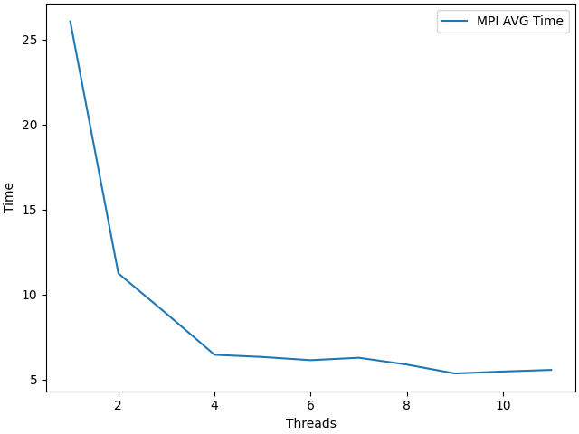

# НИЯУ МИФИ. Лабораторная работа №6. Никифоров Степан, Б21-502. 2023.
## Среда разработки
```
            .-/+oossssoo+/-.               defkit@parprog
        `:+ssssssssssssssssss+:`           --------------
      -+ssssssssssssssssssyyssss+-         OS: Ubuntu 22.04.3 LTS x86_64
    .ossssssssssssssssssdMMMNysssso.       Host: xeon-gold-6338 pc-q35-yc-2.12
   /ssssssssssshdmmNNmmyNMMMMhssssss/      Kernel: 5.15.0-91-generic
  +ssssssssshmydMMMMMMMNddddyssssssss+     Uptime: 1 hour, 55 mins
 /sssssssshNMMMyhhyyyyhmNMMMNhssssssss/    Packages: 784 (dpkg), 4 (snap)
.ssssssssdMMMNhsssssssssshNMMMdssssssss.   Shell: bash 5.1.16
+sssshhhyNMMNyssssssssssssyNMMMysssssss+   Resolution: 1024x768
ossyNMMMNyMMhsssssssssssssshmmmhssssssso   Terminal: /dev/pts/1
ossyNMMMNyMMhsssssssssssssshmmmhssssssso   CPU: Intel Xeon (Icelake) (8) @ 1.995GHz
+sssshhhyNMMNyssssssssssssyNMMMysssssss+   GPU: 00:01.0 Vendor 1234 Device 1111
.ssssssssdMMMNhsssssssssshNMMMdssssssss.   Memory: 240MiB / 15987MiB
 /sssssssshNMMMyhhyyyyhdNMMMNhssssssss/
  +sssssssssdmydMMMMMMMMddddyssssssss+
   /ssssssssssshdmNNNNmyNMMMMhssssss/
    .ossssssssssssssssssdMMMNysssso.
      -+sssssssssssssssssyyyssss+-
        `:+ssssssssssssssssss+:`
            .-/+oossssoo+/-.
```

## Информация об MPI
mpich == 4.0<br>


## Aлгоритм
## Описание алгоритма 
идем циклом for до корня от числа, если число делится на перебираемое, увеличиваем counter на 1

### Временная оценка алгоритма
$O(sqrt(n)/p)$<br>

n - число элементов в массиве<br>
p - число используемых потоков<br>

## Экспериментальные вычисления

## Таблица время работы каждого из процессов при параллельном решении  

|Process|Elapsed Time|Found primes|
|-------|------------|------------|
|  0    |   6.834953 | 508261     |
|  1    |   7.580270 | 462443     |
|  2    |   8.526384 | 447936     |
|  3    |   8.717864 | 439219     |

### Среднее время
<br>

### Среднее ускорение
<br>
### Средняя эффективность

<br>

## Заключение
В данной лабораторной работе были использованы технологии mpi и openmp одновременно. Результаты при 4 процессах MPI и два потоках OpenMP на компьютере с 8 ядрами представлены в таблице. На графике изображено зависимость от количества процессов MPI. <br>


## Приложение
### Оценка работы параллельной программы
```c
#include <stdlib.h>
#include <stdio.h>
#include <stdbool.h>
#include <math.h>
#include <mpi.h>
#include <omp.h>

const int ROOT_PROCESS_ID = 0;

void isPrime(int n, int threads, int *counter) {
  int sqrtOfN = (int) sqrt(n);

  bool isPrime = true;

  if (n == 1) isPrime = false;

  #pragma omp parallel shared(isPrime, sqrtOfN)
  {
    #pragma omp for
    for (int i = 2; i <= sqrtOfN; i++) {
      if (n % i == 0) {
        isPrime = false;
      }
      if (!isPrime) {
        i = sqrtOfN;
      }
    }
    if (isPrime) {
      #pragma omp critical
      {
        *counter += 1;
      }
    }
  }
}

int main(int argc, char** argv) {
    MPI_Init(&argc, &argv);

    double startTime, endTime;
    
    int rank, size;
    MPI_Comm_size(MPI_COMM_WORLD, &size);
    MPI_Comm_rank(MPI_COMM_WORLD, &rank);

    if (argc != 3) {
        if (rank == ROOT_PROCESS_ID) {
            fprintf(stderr, "Usage: %s <Nstart> <Nend>\n", argv[0]);
        }
        MPI_Finalize();
        exit(EXIT_FAILURE);
    }

    int Nstart = atoi(argv[1]);
    int Nend = atoi(argv[2]);

    // Calculate workload for each process
    int workload = (Nend - Nstart + 1) / size;
    int remainder = (Nend - Nstart + 1) % size;

    // Distribute workload to processes
    int destStart = Nstart + rank * workload + (rank < remainder ? rank : remainder);
    int destEnd = destStart + workload - 1 + (rank < remainder ? 1 : 0);  

    // Set the number of threads for OpenMP
    int maxThreads = omp_get_max_threads();
    int numThreads = (size > maxThreads) ? maxThreads / size : 2;

    omp_set_num_threads(numThreads);

    MPI_Barrier(MPI_COMM_WORLD);
    startTime = MPI_Wtime();

    // Process the workload for each process
    int prime_count = 0;
    #pragma omp parallel for
    for (int num = destStart; num <= destEnd; num++) {
      isPrime(num, numThreads, &prime_count);
    }

    endTime = MPI_Wtime();
    MPI_Barrier(MPI_COMM_WORLD);

    double elapsedTime = endTime - startTime;

    // Collect results from other processes
    double* allElapsedTimes = NULL;
    if (rank == ROOT_PROCESS_ID) {
        allElapsedTimes = (double*)malloc(size * sizeof(double));
    }

    MPI_Gather(&elapsedTime, 1, MPI_DOUBLE, allElapsedTimes, 1, MPI_DOUBLE, ROOT_PROCESS_ID, MPI_COMM_WORLD);

    int* allPrimeCounts = NULL;
    if (rank == ROOT_PROCESS_ID) {
        allPrimeCounts = (int*)malloc(size * sizeof(int));
    }

    MPI_Gather(&prime_count, 1, MPI_INT, allPrimeCounts, 1, MPI_INT, ROOT_PROCESS_ID, MPI_COMM_WORLD);

    if (rank == ROOT_PROCESS_ID) {
	printf("%g\n", elapsedTime);
    }

    MPI_Finalize();
    exit(EXIT_SUCCESS);
}

```
